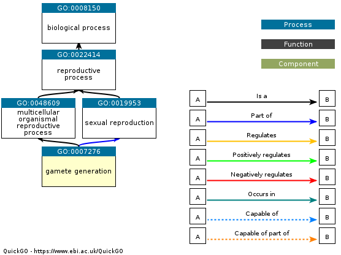

```{r setup, include=FALSE}
knitr::opts_chunk$set(echo = TRUE)
```

Using Swiss-Prot Repro subset..

Based on the following GO Term: [GO:0007276](https://www.ebi.ac.uk/QuickGO/term/GO:0007276)



# BLAST

## Get Query (GO term proteins) (do once)

getting GO

```{bash}
curl -H "Accept: text/plain" "https://rest.uniprot.org/uniprotkb/stream?format=fasta&query=%28%28go%3A0007276%29%29+AND+%28reviewed%3Atrue%29" -o ../data/SwissProt-GO:0007276.fa
```

preview file and check \# of sequences

```{bash}
head ../data/SwissProt-GO:0007276.fa
echo "Number of Sequences"
grep -c ">" ../data/SwissProt-GO:0007276.fa 
```

## Make Blast DB 

making database where the species genome is the DB

```{bash}

/home/shared/ncbi-blast-2.15.0+/bin/makeblastdb \
-in ../data/genomes_refseq/ncbi_dataset/data/GCF_026914265.1/cds_from_genomic.fna \
-dbtype nucl \
-out ../blastdb/GCF_026914265.1/GCF_026914265.1/
```

preview file and check \# of sequences

```{bash}
head ../data/genomes_refseq/ncbi_dataset/data/GCF_026914265.1/cds_from_genomic.fna
echo "Number of Sequences"
grep ">" -c ../data/genomes_refseq/ncbi_dataset/data/GCF_026914265.1/cds_from_genomic.fna
```

```{bash}
echo "Total length in Gbp"
grep -v ">" ../data/genomes_refseq/ncbi_dataset/data/GCF_026914265.1/cds_from_genomic.fna | \
tr -d '\n' | wc -c | awk '{printf "%.3f\n", $1/1e9}'
```

## Blast\*\*\*

here I need to update the variables and convert to a loop. so the fasta file path is essentially `../data/genomes_refseq/$ACCESSION` but want it to be ACCESSION_cds.zip -- will need to check on how to do this. want output to follow similar style where its `../output/ACCESSION-blastout.tab`

```{bash}
# fasta= "../data/genomes_refseq/ncbi_dataset/data/GCF_026914265.1/cds_from_genomic.fna"
# output="../output/blastout/GCF_026914265.1.tab"

/home/shared/ncbi-blast-2.15.0+/bin/tblastn \
-query ../data/SwissProt-GO:0007276.fa \
-db ../blastdb/GCF_026914265.1/GCF_026914265.1 \
-out ../output/blastout/GCF_026914265.1.tab \
-evalue 1E-10 \
-num_threads 20 \
-max_target_seqs 1 \
-max_hsps 1 \
-outfmt 6
```

### post-blast checks

```{bash}
head ../output/blastout/GCF_026914265.1.tab
```

```{bash}
wc -l ../output/blastout/GCF_026914265.1.tab
```

add headers

```{bash}

echo -e "qseqid\tsseqid\tpident\tlength\tmismatch\tgapopen\tqstart\tqend\tsstart\tsend\tevalue\tbitscore" > ../output/blastout/GCF_026914265.1_with_headers.tab
cat ../output/blastout/GCF_026914265.1.tab >> ../output/blastout/GCF_026914265.1_with_headers.tab

head -2 ../output/blastout/GCF_026914265.1_with_headers.tab

```

```{bash}

tr '|' '\t' < ../output/blastout/GCF_026914265.1_with_headers.tab \
> ../output/blastout/GCF_026914265.1_sep.tab

head -2 ../output/blastout/GCF_026914265.1_sep.tab
```

following steven's code [here](https://sr320.github.io/tumbling-oysters/posts/sr320-23-repro/)

### preview output

```{r}

blastout <- read.delim("../output/blastout/GCF_026914265.1_with_headers.tab")
head(blastout)
```

histogram of e values

```{r}
# transform data
blastout$evalue <- -log10(blastout$evalue + 1e-300)

# histogram
hist(blastout$evalue)
```

# GO ANNOTATION

### isolate spid to prep for uniprot mapping

```{bash}
#must do with the no headers version since it creates more columns than there are headers for

tr '|' '\t' < ../output/blastout/GCF_026914265.1.tab \
> ../output/blastout/GCF_026914265.1_sep.tab

head -3 ../output/blastout/GCF_026914265.1_sep.tab
```

```{r}

SPID <- read.csv("../output/blastout/GCF_026914265.1_sep.tab", sep = "", header = F)
head(SPID)

write.csv(SPID$V2, "../output/GCF_026914265.1_SPID.txt", row.names = F, col.names = F, quote = F)
```

### GO terms were gathered from [uniport ID mapping](https://www.uniprot.org/id-mapping), with the text file generated above being used as the input. columns were customized to include biological proccess GO information. output was saved as a .tsv.

need to join together the BLAST output with the GO info to complete the annotation

```{r}
# going to create a dataframe for us to join the uniprot output to

annot <- read.csv("../output/blastout/GCF_026914265.1_with_headers.tab", sep = "")
head(annot)

# add SPID as column so have a point to join by 

annot$SPID <- SPID$V2
head(annot)

```

```{r}
# read in uniprot output

uniprot <- read.delim("../output/GCF_026914265.1_uniprotout")
head(uniprot)

# create SPID column for joining (same as entry)

uniprot$SPID <- uniprot$Entry
head(uniprot)
```

```{r}
library(dplyr)
```

```{r}
# now join

annot_w_GO <- left_join(annot, uniprot, by = "SPID")
head(annot_w_GO)

write.csv(annot_w_GO, "../output/GCF_026914265.1_annotation.tab", sep = "")

temp <- read.csv("../output/GCF_026914265.1_annotation.tab")
```

# GENE LIST

if multiple query sequences matching to the same db (genome) sequence, could filter for the one with the highest bitscore. Don't need to do this however.

### create gene list

I want to save 2 files: the full annotation (annot_W\_go; this was done above) AND one with just key info (seq id, gene name for top hit, go info, e value, and bit score)

unflitered:

```{r}

gene_list <- data.frame(annot_w_GO$qseqid, annot_w_GO$sseqid, annot_w_GO$pident, annot_w_GO$evalue, annot_w_GO$bitscore, annot_w_GO$SPID, annot_w_GO$Entry.Name, annot_w_GO$Protein.names, annot_w_GO$Gene.Names, annot_w_GO$Organism, annot_w_GO$Length, annot_w_GO$Gene.Ontology.IDs, annot_w_GO$Gene.Ontology..biological.process., annot_w_GO$Gene.Ontology..GO., annot_w_GO$Developmental.stage, annot_w_GO$Induction, annot_w_GO$Induction, annot_w_GO$Tissue.specificity)

head(gene_list)
```

```{r}
write.csv(gene_list, "../output/genelist_GCF_026914265.1.csv")
```

if doing filtered by bitscore:

```{r}

annot_w_GO_top <- annot_w_GO %>%
  group_by(sseqid) %>%
  slice_max(bitscore, with_ties = FALSE) %>%
  ungroup()

head(annot_w_GO_top)
```

```{r}

gene_list_topbit <- data.frame(annot_w_GO_top$qseqid, annot_w_GO_top$sseqid, annot_w_GO_top$evalue, annot_w_GO_top$bitscore, annot_w_GO_top$SPID, annot_w_GO_top$Entry.Name, annot_w_GO_top$Protein.names, annot_w_GO_top$Gene.Names, annot_w_GO_top$Organism, annot_w_GO_top$Length, annot_w_GO_top$Gene.Ontology.IDs, annot_w_GO_top$Gene.Ontology..biological.process., annot_w_GO_top$Gene.Ontology..GO., annot_w_GO_top$Developmental.stage, annot_w_GO_top$Induction, annot_w_GO_top$Induction, annot_w_GO_top$Tissue.specificity)

head(gene_list_topbit)
```
